## Table of Contents
* [Purpose](#Purpose)
* [User Experience Design (UX)](#User-Experience-Design)
  * [User stories](#User-Stories)
    * [First Time Visitor Goals](#First-Time-Visitor-Goals)
    * [Returning Visitor Goals](#Returning-Visitor-Goals)
    * [Frequent User Goals](#Frequent-User-Goals)
    * [Admin Goals](#admin-user-goals)
  * [Structure](#Structure)
  * [Design](#Design)
    * [Colour Scheme](#Colour-Scheme)
    * [Typography](#Typography)
    * [Wireframes](#Wireframes)
    * [Limitations](#Limitations)
* [Features](#Features)
    * [Existing Features](#Existing-Features)
    * [Future Features](#Features-Left-to-Implement)
* [Technologies](#Technologies)
* [Testing](#Testing)
    * [Test Strategy](#Test-Strategy)
      * [Summary](#Summary)
    * [Test Results](#Test-Results)
    * [Testing Issues](#Issues-and-Resolutions-to-issues-found-during-testing)
* [Deployment](#Deployment)
    * [Project creation](#project-creation)
    * [Deploying on Heroku](#deploying-on-heroku)
    * [Locally](Run-Locally)
* [Credits](#Credits)
    * [Code](#Code)
    * [Content](#Content)
    * [Media](#Media)
    * [Acknowledgements](#Acknowledgements)
    * [Comments](#Comments)

## Purpose
This Website was created for the sole purpose of completing the fourth Milestone Project for the Code Institute's Full Stack Developer course. 
It was built using the knowledge gained from the HTML, CSS, JavaScript, Python, Django and SQL modules. A full list of technologies used can be found in the technologies section of this document.

The live website can be found [here](https://stuff-express-app.herokuapp.com/)<br>
 - impossible to generate mock-up yet-> server error

## User Experience (UX)

-   ### User stories

 As a **(role)** I can **(capability)**, so that **(received benefit)**

| User story ID | As A/An  | I want to be able | So that I can...  |
|---------------|----------|-------------------|-------------------|
|View and Navigation |             |           |                   |
| 1 |   Shopper   | View a list of  products               | Select products to purchase    |
| 2 |             | View a specific category of products   | Quickly find products without having to search through all products  |
| 3 |             | View individual product details        | Identify the price, description, product rating, product image, available sizes |
| 4 |             | Quickly identify deals and special offers| Take advantage of special savings  |
| 5 |             | Easily view the total price of my purchases at any time | Avoid spending too much   |
| Registration and User |        |         |
| 6 |  Site User  | Easily register an account                        | Have a personal account to view my profile and orders           |
| 7 |             | Easily login or logout                            | Access my personal account information                          |
| 8 |             | Easily recover my password in case i forget it    | Recover access to my account                                    |
| 9 |             | Receive an email confirmation after registering   | Verify that my account registration was successful              |
| 10 |            | Have a personalized user profile                  | View my personal order history and save my payment information  |
|      Sorting and Searching         |                   |
| 11 |   Shopper   | Sort the list of available products                                 | Easily identify the best rated, best priced and categorically sorted products   |
| 12 |             | Sort a specific category of products                                | Find the best-priced or the best-rated product in a specific category           |
| 13 |             | Sort multiple categories of products                                | Find the best-priced or the best-rated products accross broad categories        |
| 14 |             | Search for a product by name or description                         | Find a specific product I'd like to purchase                                    |
| 15 |             | Easily see what I've searched for and the number of results         | Quickly decide whether the product I want is available                          |
|     Purchasing and Checkout    |             |             |    |
| 16 |   Shopper   | Easily select the size and quantity of a product when purchasing it | Ensure I don't accidentally select the wrong product, quantity or size          |
| 17 |             | View items in my basket                                             | Identify the total cost of my purchjase and all items I will receive            |
| 18 |             | Adjust the quantity of individual items in my bag                   | Easily make changes to my purchase before checkout                              |
| 19 |             | Easily enter my payment information                                 | Check out quickly                                                               |
| 20 |             | Feel my personal and paymen information is safe and secure          | Confidentialy provide the needed information to make a purchase                 |
| 21 |             | View an order confirmation after checkout                           | Verify that I haven't made any mistakes                                         |
| 22 |             | Receive an email confirmation after checking out                    | Keep the confirmation of what I've purchased for my records                     |
|   Admin and Store Management   |             |                                                  |                         |
| 23 | Store Owner | Add a product                                                       | Add new items to my store                                                       |
| 24 |             | Edit/ update a product                                              | Change product prices, descriptions, images and other product criteria          |
| 25 |             | Delete a product                                                    | Remove items that are no longer for sale                                        |
    
       
-   ### Structure

     - All Pages will contain a Navigation menu at the top of the Webpage that directs them to a new Page to allow users to Navigate the site easily. The Nav Menu will be collapsable on a Mobile device to make use of space on smaller devices.<br>
        
    - Bootstrap framework will be used to make the website resposive on different devices and display organised content.
    All pages will be responsive and the layouts will change dependant on screen size. This is to ensure content flow is appealing, images are displayed properly and that the content is not shrunk side by side, so small that it is unreadable.<br>

    - All pages will contain a Footer Element Social Media Icons and link to Email contact form. The icons used will be from font-awesome. These are referenced below in the Technologies section of this document.<br>

    - A Registration page will be provided so the users can register an account
	    - this gives to user the opportunity to register an account and save a order history, make reviews or delete reviews
	    - a link to login page is provided at the bottom of the page in case user already has an account<br>
        The purpose of this is to fulfill user story:
        > Site user - Easily register an account

    - A login page will be provided so any registered user can login 
	    - this gives to registered user the possibility to create/edit reviews at any time after registration
	    - a link to register page is provided at the bottom of the page in case the user doesn't have an account already<br>
        The purpose of this is to fulfill user story:
        > Site user - Easily login or logout<br>

    - A logout link will be displayed in the navbar for any logged in user
	    - this is to ensure the user's data are not accessible for other users<br>
        The purpose of this is to fulfill user story:
        > Site user - Easily login or logout

    - A dedicated page to list items will be provided for registered users (admin only at the moment)
        The purpose of this is to fulfill user story:
        > Store owner - Add a product<br>
    
    - An edit review page will be provided for logged in users if the user is the creator of the review<br>

    - A profile page will be provided for any logged in user
	    - the page will display only the order history and saved details<br>
       
-   ### Design
    -   #### Colour Scheme
        - The main colour of the site is white
        - The buttons have a white background and a black border: #000
        - On hover, focus the buttons go dark grey #333 with a white text

    -   #### Typography
        - Font used for headings, buttons: 'Inter' with 'Arial' as fallback font in case 'Inter' is not loaded
        - Font used for all other texts: 'Roboto' with 'Helvetica' as fallback in case 'Roboto' is not loaded
       
    -   #### Imagery
        - Icons from [font awesome](https://fontawesome.com/) where appropriate and photos of the products
        
    -   #### Wireframes
        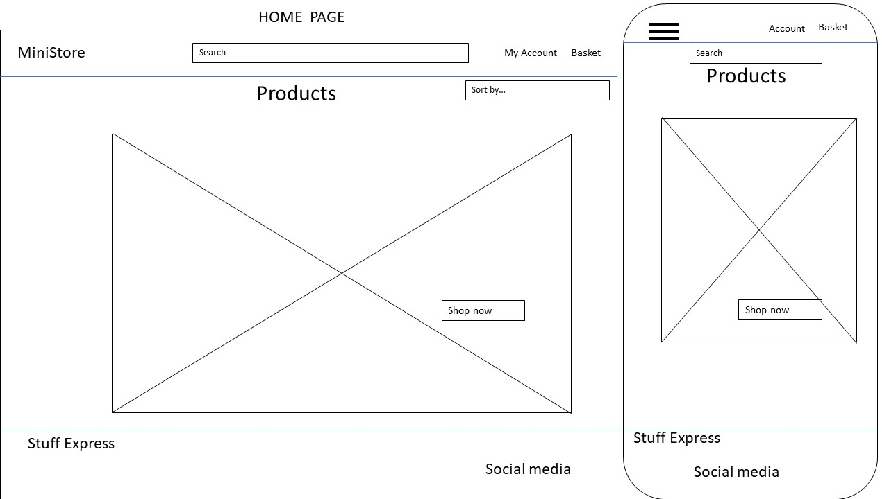
        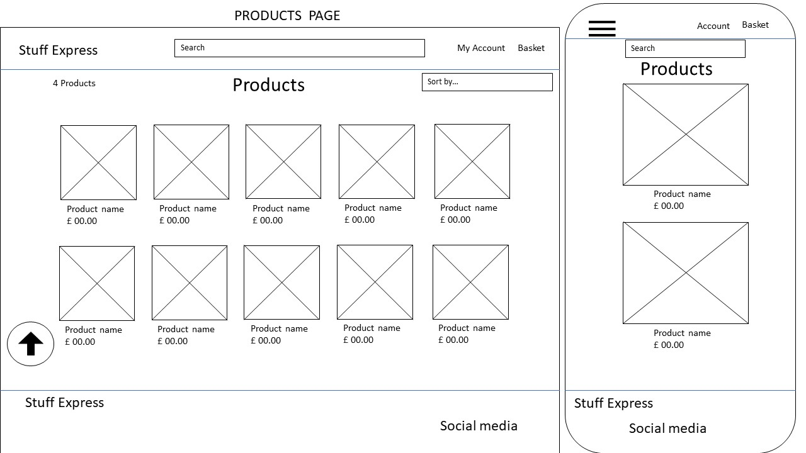
        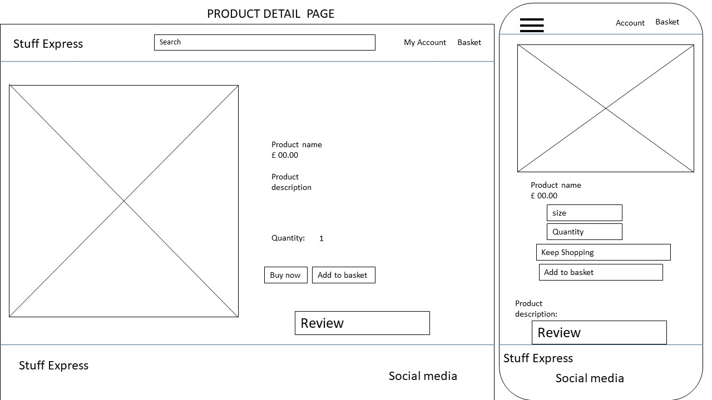
        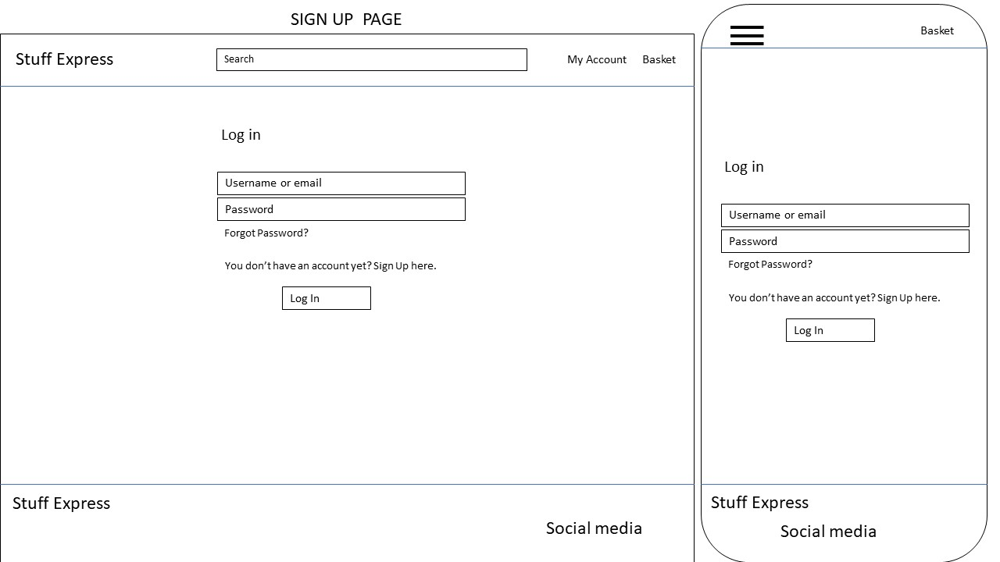
        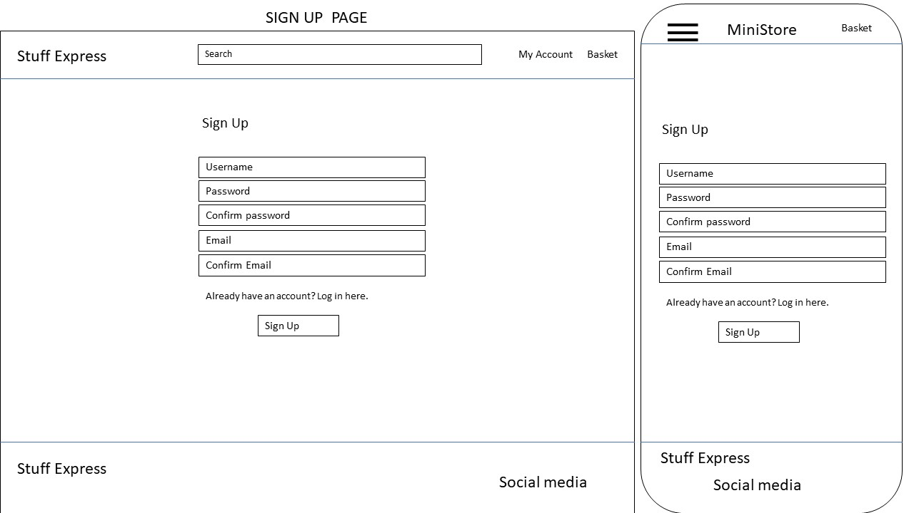
        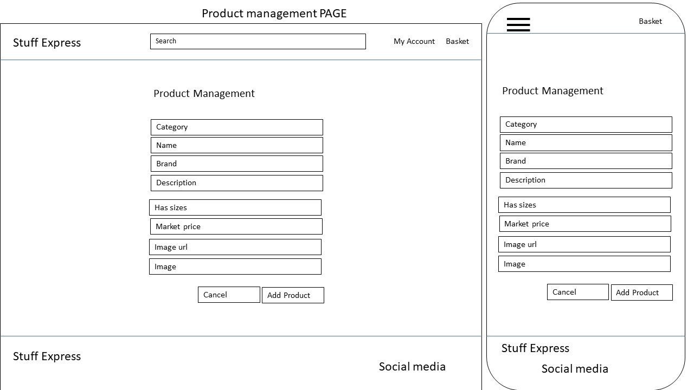
        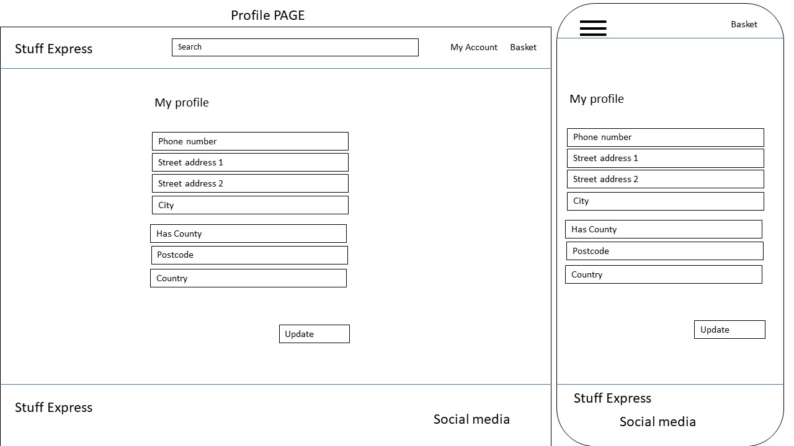
        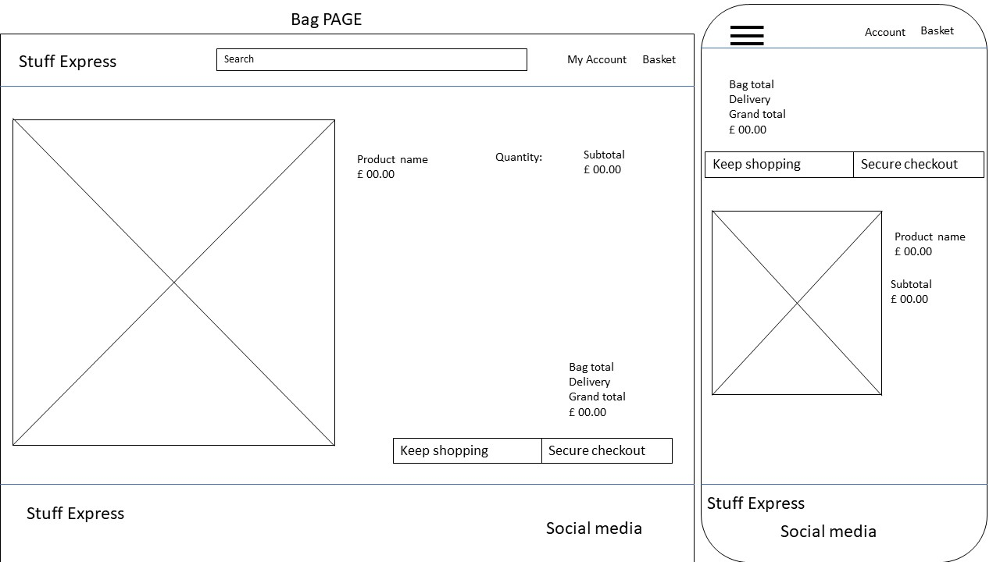
        
    - #### Database
        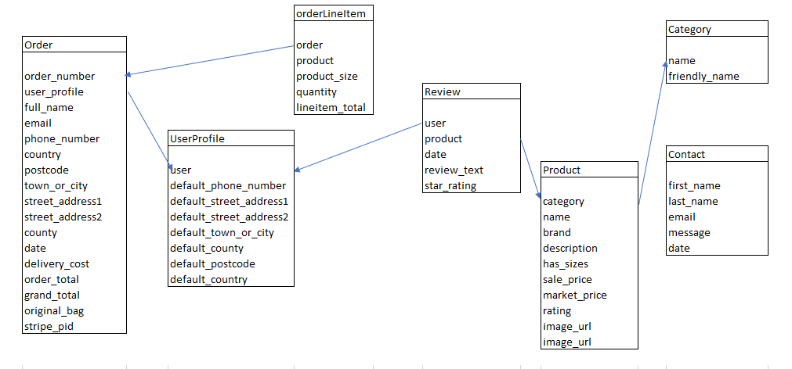

-   ### Limitations
    - Not possible for people to sell items on site unless they are admin
    - No favicon 

***
## Features
 
-   ### Existing Features
    - Navigation Bar
    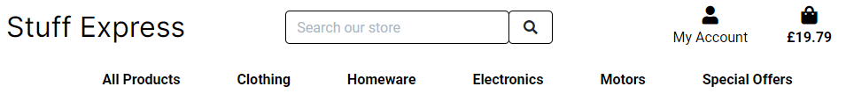

    - Registration form
    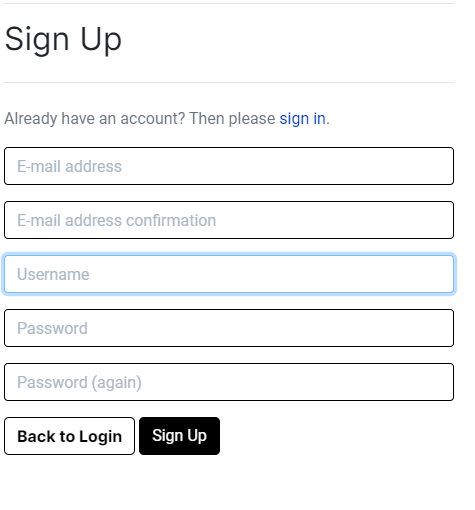

    - Footer
    


The navigation bar is fixed in position at the top of the page.
It includes 
1) The company logo which is also a link to the home page.
2) Links to the other available pages on the site e.g. the shop or products, the basket and the user options which vary on login.
3) A running total of the contents of the customers virtual shopping basket. This doubles as a link to the basket page.
4) A search bar to search through all the products name and description.

The user options are represented by a font awesome icon which on click displays a dropdown menu with the following options:-
1) If the user is staff then Product management.
2) If user signed in then the user name is displayed and a logout link
3) If no user is logged in then both a register and login option are presented.

The navigation bar is fully responsive and the links are replaced on smaller screens with a hamburger icon.    
The User options, search and basket total move next to it.

### Search box
-   The search box beside the logo alows searching of the products name and description for a keyword.    
-   This drops to the second line on smaller screens so it is always easily accessible.
-   This example shows the results of the search for the cheese keyword. The wine is shown also because it has the word cheese in its description.


### Footer


-   The footer features the businesses email and a link to their social pages.

### Shop

-   This page displays all the products that are available to purchase on the site.

-   This page also has a filter and sort feature which allows users to display the products in a certain category only

### Product Details

-   Clicking on a product displays the full details for that item.
-   Only the appropriate details appear for the product 
-   Also, only filled in details are shown. Blank fields are not displayed on the screen.
-   There is a quantity field that takes a number and an `Add to basket` button to select this product for purchase.
-   The user can type in an amount or use the arrow buttons which don't go below 1.
-   When an item is added to the basket a success message appears informing the user.    
-   It also summarises the contents of the basket and shows the total excluding delivery.    
-   There is also a button to go to checkout. A secure payment facilitiy is indicated by displaying a lock item on the button.
-   The message can be dismisses by clicking the x but it also disappears by itself after a few seconds.

### Authentication

-   If the user is not logged in then they have the option to either register or login.
-   If the user is logged in they have the option to logout.

### Shopping Basket

-   If the users virtual shopping basket is empty then this page will just display a message that the basket is empty and     
    provide a link back to the Shop or Products page.


-   If there are items in the basket then these are listed displaying the core details for the product and the quantity selected.    
    A small image of the product is displayed.    
    The sub-total is displayed (Quantity * Price).    
    At this point the user can change the quantity of any item in the basket or remove it entirely.    
    If the quanity is changed then the sub-total is recalculated and a feedback message displayed.    
    The basket total is also displayed with the delivery charge and the grand total.    
    These are re-calulated as item quantities change.    

-   There is a button link back to the shop or product page and a button link to continue to checkout.    

### Checkout

-   The checkout page provides a form for users to fill in with their details.
-   It also contains a summary of the items in the basket which will be used to create the order.
-   The totals for the order are displayed.
-   A stripe card element is used on this page to collect the card details.    
    Javascript is used to 
    1) Mount and style the card element
    2) Display any feedback errors received
    3) Handle form submit
-   There is a button provided for confirming the payment. It displays a lock icon to indicate security. 
-   There is also a little summary message in red displayed with the total amount that will be charged to the card on confirming the payment.
-   There is a button link provided at this point to return to the basket for making adjustments.
-   If logged in the user can choose to save their delivery details which are defaulted on the checkout page for them.


-   If the card details are incorrect an error message is displayed    
  
-   If the details are correct a spinner is displayed while the order is being processed.
 
### Checkout confirmation
-   The checkout confirmation page provides a summary of the order for users and a link back to the shop.

### Deals
-   This is option from the nav menu which takes users directly to the products filtered by deals.    

### My Profile

-   The profile page allows the user to edit their delivery details and view their previous orders.
-   A feedback message is sent when the profile is updated.

-   On clicking the order number the confirmation screen is shown with a button back to the profile page

-   ### Features Left to Implement

    - User to be able to sell products
    - Link to sell page
   
***

## Technologies

* HTML
	* This project uses HTML as the main language used to complete the structure of the Website.
* CSS
	* This project uses custom written CSS to style the Website.
* Django
    * This is used as the main connection between frontend and backend
* Python
    * This is used as the backend of the project
* Postgresql
    * This is used as database for Users and Categories 
* [MongoDB](https://www.mongodb.com/)
    * This is used as database for Recipes details (name, ingrediets, cooking steps, cooking time, preparation time, owner of the recipe)
* [Bootstrap]
    * This is used as frontend framework to display the content in an organized way
* [Font Awesome](https://fontawesome.com/)
	* Font awesome Icons are used for the Social media links contained in the Footer section of the website
* [Google Fonts](https://fonts.google.com/)
	* Google fonts are used throughout the project to import the *Spectral* and *Lora* fonts.
* [Gitpod](https://gitpod.io/)
	* Gitpod is the tool used to develop the Website.
* [GitHub](https://github.com/)
	* GithHub is the hosting site used to store the source code for the Website
* [Git](https://git-scm.com/)
	* Git is used as version control software to commit and push code to the GitHub repository where the source code is stored.
* [Heroku](https://dashboard.heroku.com/)
    * Heroku is used to deploy the web app
* [Pixlr](https://pixlr.com/)
	* Pixlr is used to reduce the file sizes of images before being deployed to reduce storage and bandwith.
* [Google Chrome Developer Tools](https://developers.google.com/web/tools/chrome-devtools)
	* Google chromes built in developer tools are used to inspect page elements and help debug issues with the site layout and test different CSS styles.
* [Coolors](https://coolors.co/)
    * This was used to select color palette. 
* PowerPoint
    * This was used to create wireframes
* [Wave Accessibility tool](https://wave.webaim.org/)
    * this was used to test the website for accessibility for impaired persons
***

## Testing

-   ### Test Strategy 

    -   #### Summary 

    -   ### Test Results
        - Deployed version has some differences compare to development version

    - All Pages were run through the [W3C HTML Validator](https://validator.w3.org/) and showed no errors.<br>
   
    - CSS Stylesheet was run through the [W3C CSS Validator](https://jigsaw.w3.org/css-validator/) and showed no errors.<br>
   
    - Js files were run through [JSHint](https://jshint.com/) and showed no errors.<br>
    
    - Python files were run through [Pep8](http://pep8online.com/) and showed no errors.<br>
    
    - Website was tested by running locally and tested on the deployed version on three different browsers:
       
    - Test header's logo to redirect to home.html (on all pages) - worked as expected on all tested browsers

    - Navbar displays: 
      
    - Navbar on mobile: 
       
    - Home page has two images with links:
        
    - Register form:
	   
    - Login form:
	   
    - Log out
        
    - Footer: 
       

### Issues and Resolutions to issues found during testing


    #### Known bugs/errors not fixed
   

***
## Deployment

This project was developed using a [GitPod](https://gitpod.io) workspace. The code was committed to [Git](https://git-scm.com) and pushed to [GitHub](https://github.com) using the terminal.

-   ### Project Creation
The project was started by navigating to the [template](https://github.com/Code-Institute-Org/gitpod-full-template) and clicking 'Use this template'. Under Repository name I input "Food-Fiesta" and checked the Include all branches checkbox. I then navigated to the new [repository](https://github.com/BogdanCatalin-Iacob/Stuff-Express). I then clicked the Gitpod button to open the project in Gitpod.

 The following commands were used throughout the project:

* git add filename - This command was used to add fils to the staging area before commiting.
* git commit -m *commit message explaining the updates* - This command was used to to commit changes to the local repository.
* git push - This command is used to push all commited changes to the GitHub repository. 

### Deploying on Heroku

## Local Development
### Making a Local Clone

1. Log in to GitHub and locate the [GitHub Repository](https://github.com/BogdanCatalin-Iacob/Stuff-Express)
2. Click the [Code](//docs/images/deployment/clone-button.png) button and then choose your method.
3. To clone the repository using HTTPS, under the "HTTPS" tab copy the link. You could also choose to open it with Github Destop, Visual Studio or download it as a zip file.
4. Open the command prompt on your computer
5. Go to the location where you want the clone to be created.
6. Type `git clone`, and then paste the URL you copied in Step 3.

  ```
  $ git clone https://github.com/
  ```

7. Pressing `Enter` will create the clone.

<br>

### Forking the GitHub Repository

Forking means making a copy of the original repository on your own GitHub account.     
This gives you your own version to make changes to without affecting the original repository.

1. Log in to GitHub and locate the [GitHub Repository](https://github.com/)
2. Locate the [Fork]() button at the top right of the github page.
3. Click this to see the `Create a new fork` page. Click `Create fork` and you should now have a copy of the original repository in your GitHub account.

<br>

### Setting up your local environment

1. Open the project in your choice of editor.
2. Create an `env.py` file. It needs to contain the following variables:

  * Database URL - This can be obtained from [heroku](https://dashboard.heroku.com/) once an app has been set up.    
    It is defaulted to the DATABASE_URL config var on the settings tab - see the `Deployment to Heroku` section below. 
  * Secret_key - This is the django secret key for the app. It can be anything you like or you can use [the django secret key generator](https://miniwebtool.com/django-secret-key-generator/). 


```import os
os.environ["DATABASE_URL"] = 'postgres://xxxxxxxxxxxxxxxxxxxxxxxxxxxxxxxxxxxxxxxxxxxxxxxxxxxxxxxxxxxx'
os.environ["SECRET_KEY"] = 'xxxxxxxxxxxxxxxxxxxxxxxxxxxxxxxxxxxxxxxxxxxxxxxxxxxxxxxx'
```

3. Install app requirements
```
pip3 install -r requirements.txt
```

4. Migrate the database models  
```
python3 manage.py migrate
```

5. Create a superuser and set up its credentials 
```
python3 manage.py createsuperuser
```

6. To run the application locally 
```
python3 manage.py runserver
```

### Getting Stripe keys
Login to [Stripe](https://dashboard.stripe.com). Create an account if you don't have one.    
Go to developers tab (button on right of page). On side menu you will find API keys.     
Copy `Publishable key` as STRIPE_PUBLIC_KEY and `Secret key` as STRIPE_SECRET_KEY.    
<br>
If you click on the Payments tab you will be able to see all your test payments once you have made some.

<br>

### Getting email variables from gmail

- Log into your gmail account or [create](https://mail.google.com) one if you don't have one. 
- Go to Settings and than [See all settings]()
- Then go to the `Accounts and Import` tab and click the `Other Google Accounts settings` [link](//docs/images/deployment/other-google-account-settings.png).
- Click the `Security` tab. 
- Turn on `2-Step Verification`: enter a phone number and follow the instructions.
- On the `Security` tab, click on App passwords
- App passwords - Select Mail, Select Device - Other, Django and click `GENERATE`. Copy the app password generated.

In Heroku 
Set the `EMAIL_HOST_PASS` in [Config vars]() to the password copied from above.
Set the `EMAIL_HOST_USER` is the gmail email address.

<br>

## Remote Deployment
This project was deployed using Heroku.    
If you don't have an account you can create one [here](https://dashboard.heroku.com/apps "Heroku").

<br>

### Deployment to Heroku

1.  Login to your Heroku account
2.  Create an new app - name must be different to ``
3.  Attach the database - Search for the Heroku POSTGres add-on in the [Resources](/) tab 
    - This will default a unique value to a variable called DATABASE URL in the convig vars on the Settings tab.
4.  Set up the following additional variables here also
    - EMAIL_HOST_PASS - See `Getting email variables from gmail` above
    - EMAIL_HOST_USER - See `Getting email variables from gmail` above
    - SECRET_KEY - See `Setting up your local environment` above
    - STRIPE_PUBLIC_KEY - See `Getting Stripe keys` above
    - STRIBE_SECRET_KEY - See `Getting Stripe keys` above
5.  Go to your local clone folder and make sure it has a Procfile containing `web: gunicorn `.    
6.  Open the folder from your editor and in settings.py add your Heroku appname to ALLOWED_HOSTS     
    e.g. `ALLOWED_HOSTS = ['', 'localhost']`
7. Commit your changes and push to github
8. Go back to Heroku and click the `Deploy` tab in the menu bar. 
9. Go down to `Deployment method` and choose [GitHub]().
10. A new section will appear called `Connect to GitHub` giving you an entry box for the repository to connect to.
11. Enter the name of your repository and click the `search` button
12. If the repository you entered exists heroku will list it. Click `connect`
13. Now go down to the next section called `Automatic Deploys` .
14. Click `Enable automatic deploys` if you want changes pushed to github to be automaticaly deployed to heroku.
15. Click `Deploy branch`

You will see the progress of the deployment from messages displayed until finally it will say `Your app was successfully deployed`

16. Click the button `View` to open the website

<br>


## To run the application
- The application has been deployed to https://    
  It can be accessed there or through the github repository - https://github.com/

To deploy this page to Heroku from its GitHub repository, the following steps were taken:

1. Create the Heroku App:
    - Select "Create new app" in Heroku.
    - Choose a name for your app and select the location.

2. Create a file named "requirements.txt" and a file named "Procfile" with the following CLI commands:
    - pip3 freeze > requirements.txt
    - echo web: python run.py > Procfile

3. Attach the Postgres database:
    - In the Resources tab, under add-ons, type in Postgres and select the Heroku Postgres option.
    - Click "More" dropdown
    - Select "Run console"
    - type: "python3"
    - import db from the project
    - type CLI command: "db.create_all()"
    - exit()

4. Prepare the env and __init__.py file:
  

5. Log in to Heroku using the terminal Heroku login -i.
    - Then run the following command: **heroku git:remote -a your_app_name_here** and replace your_app_name_here with the name of your Heroku app. This will link the app to your Gitpod terminal.
    - After linking your app to your workspace, you can then deploy new versions of the app by running the command **git push heroku main** and your app will be deployed to Heroku.

    - Or under the "Deploy" menu on Heroku, select:
        - Deployment method: Connect Github
        - Search for name of your project on Github
        - Connect
        - Enable automatic deploys

-   ### Run Locally
1. Navigate to the GitHub [Repository:](https://github.com/BogdanCatalin-Iacob/Stuff-Express)
1. Click the Code drop down menu.
1. Either Download the ZIP file, unpackage locally and open with IDE (This route ends here) OR Copy Git URL from the HTTPS dialogue box.
1. Open your developement editor of choice and open a terminal window in a directory of your choice.
1. Use the 'git clone' command in terminal followed by the copied git URL.
1. A clone of the project will be created locally on your machine.

***
## Credits
-   ### Code
   

-   ### Content
    
    
-   ### Media
   

-   ### Acknowledgements
    - I'd like to thank my mentor Daisy McGirr for her guidance throughout my project.<br>